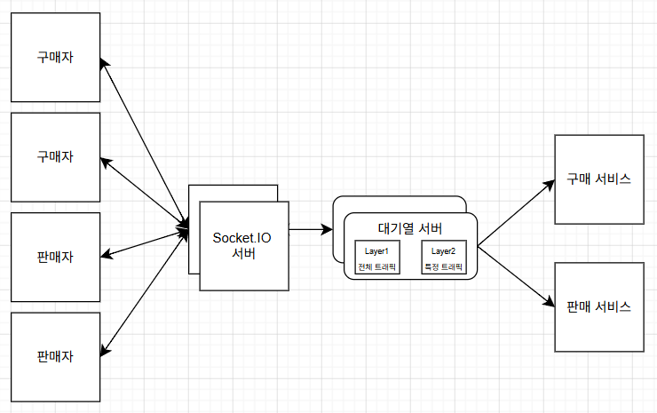

# 네이버페이 확장 가능한 대기열 개발기를 읽고

> 참고한 아티클: [네이버페이 주문에 적용된 확장 가능한 대기열 개발기](https://d2.naver.com/helloworld/6480558?fbclid=IwQ0xDSwMYJqRleHRuA2FlbQExAAEezGewkw84pRh8vklAQL8u-sQYIKowIyBZPcQNUed0qsvdGDhglHyi3qp9RFs_aem_Ct8RdYJjKKDXJ37SNN6FKQ)

## 1. 요구사항 정리 & 질문 리스트

1. 이벤트성 트래픽은 감지되면 어떻게 대기열 서버에 트리거가 되어 대기열이 생기게 되나요?
   - **댓글 확인**: 트래픽은 평소에도 **Massronome(대기열 서비스)**를 거쳐서 들어온다. 대기열이 발동해있지 않은 상태면 통계 데이터를 수집
2. 트래픽이 과하다는 것은 어느 정도를 말하는 건가요?
3. 판매자가 판매 게시할 때의 대기열이 필요한 건가요?
4. 같은 대기열 서버에서 구매자와 판매자를 나눠서 대기 시켜야 하나요? 아니면, 구매자 대기열 서버, 판매자 대기열 서버 나눠서 진행해도 되나요?
   - 일단 구매자 대기열 서버와 판매자 대기열 서버가 분리 되어있다고 생각하고 진행

## 2. 궁금증 1: 트래픽을 어떻게 가려내나

#### 판매자별로 트래픽을 어떻게 관리하지?

> 댓글에서 통계 데이터로 수집된다고 하니 판매자별 트래픽 관리가 가능할 것이라고 생각했다.
{: .prompt-tip }

#### 주문 서버 하나를 트래픽이 많은 판매자 전용으로 돌리는 건가?
   - 아니면, 판매자ID로 오는 요청을 일단 전부 대기열에 넣으면 되는 건가? 다른 판매자ID는 그냥 흘려보내고

> 대기열 서비스는 과도한 트래픽이 감지된 판매자ID는 대기열 서비스에서 잡고, 다른 판매자ID는 그냥 흘려보낸다.
{: .prompt-tip }

#### 전체 주문 서비스에도 대기열을 놓고 특정 판매자별로 대기열을 놓게 되면 구조가 어떻게 설계되는 거지?

> 대기열이 한 종류가 아니라 **두 층위**로 존재한다고 이해했다.
> - **전체 주문 서비스 보호용 대기열**: 서비스 전체가 감당할 수 있는 처리량을 넘어서는 트래픽을 막는 안전장치.
> - **판매자ID별 대기열**: 특정 판매자에게만 트래픽이 몰릴 때, 그 판매자ID에 대해서만 발동되는 대기열.
>
> 핵심은 **대기열을 미리 깔아두는 게 아니라, 평소엔 Massronome가 통계만 수집하다가 임계치를 넘는 트래픽이 감지된 대상(전체든 특정 판매자ID든)에 대해서만 동적으로 대기열을 발동**시킨다는 점이다. 
>  
> 그래서 "전체 + 판매자별"이 동시에 존재해도, 발동되지 않은 대기열은 그냥 트래픽을 흘려보내므로 구조가 복잡해지지 않는다.
{: .prompt-tip }

## 3. 궁금증 2: 왜 Socket.IO인가

#### 왜 Socket.IO 서버를 앞에 뒀을까? 다른 방법은 없었을까?
#### 대기열 서버에 클라이언트가 조회하는 게 부담이라면, 그냥 캐시를 둬서 거기서 대기열 관리가 안 되나?

> 대기열의 본질은 **"네 순번 아직이야 / 이제 들어와도 돼"를 구매자에게 계속 알려주는 것**
>   
> 여기서, 캐시를 사용하는 것이 의미가 없다는 것을 알 수 있다.
> 계속 해서 물어보기 때문에, 캐시를 사용한다고 해서 조회 횟수가 줄어드는게 아니다.
>
> 즉 **캐시는 "상태 저장소" 역할이고, Socket.IO 서버는 "수많은 연결을 들고 있다가 갱신을 밀어주는 중계 계층" 역할**이라 서로 대체재가 아니다.
{: .prompt-tip }

#### 대기열 서버가 추가되면 그에 따라 Socket.IO 서버도 늘어날 거고, 결국 많은 구매자들과 Socket.IO는 소켓 연결을 계속 맺고 있어야 하는데 리소스/비용 관리 측면에서 웹소켓을 계속 연결하고 있어도 괜찮나?
   - Socket.IO 서버는 클러스터를 증가해 통신 자원 부족 문제를 해결하고, 순번 구간에 따라 정보 갱신 여부나 주기를 대기열 서버에서 능동적으로 결정 때문인가?
   - Socket.IO를 사용했을 때 장점?

> "웹소켓을 계속 맺고 있어도 괜찮나?"의 답은 **앞단을 가볍게(수평 확장 쉽게) 만들고, 보낼 메시지 양 자체를 순번대로 줄여서 괜찮게 만든다**로 이해했다. 두 가지 장치가 있다.
> - Socket.IO 서버는 **상태가 거의 없는** 중계 계층이라 수평 확장(클러스터 증설)이 쉽다. 무거운 대기열 로직은 뒤(대기열 서버)에 있고 앞단은 "연결 들고 메시지 전달"만 하므로, 연결이 늘면 서버를 늘리면 된다.
> - **순번 구간에 따라 갱신 주기를 차등**한다. 1만 번 뒤에 있는 사람에게 0.5초마다 "아직이야"를 보내는 건 낭비다. 입장이 가까운 앞 구간은 자주, 한참 뒤 구간은 드물게 갱신하도록 **대기열 서버가 능동적으로 결정**해 푸시 양 자체를 줄인다.
{: .prompt-tip }

## 4. 궁금증 3: 대기표 저장 구조: 왜 '정렬 저장'은 확장성이 없나

#### 대기표를 정렬하여 저장하는 방식은 확장성에 한계가 있다. 왜지?

- 단일한 값으로 저장소에 저장하고, 각 대기열의 현재 진입 가능한 순번 범위만을 관리하는 방식인가?
- 예를 들어 구매자가 1~1000명이 들어왔다고 치면, 이 구매자들은 순번에 맞게 1번부터 1000번까지 티켓을 가지고 저장소에서 기다리다가, 대기열 서버가 "1~10번 들어가" 하면 들어가고 "20~30번 들어가" 하면 들어가는 형식인가?

> 내가 든 예시가 맞는 방향이라고 이해했다.
> - **정렬 저장의 한계**: 100만 명을 1, 2, 3 … 1,000,000으로 한 줄 세워 저장하면, 누가 들어오고 나갈 때마다 **정렬 상태를 유지하는 비용**이 든다. 게다가 이런 정렬 자료구조는 보통 한 곳(단일 저장소)에 묶여서 **여러 서버로 쪼개기 어렵고**, 부하가 한 점에 몰린다 → 확장성 한계.
> - **대신 "순번 범위(경계값)만 관리"**: 개개인을 줄세우는 대신, 각 구매자는 **자기 티켓 번호**만 들고 저장소에서 기다리고, 대기열 서버는 **"지금 입장 가능한 순번은 N번까지"라는 경계값 하나**만 관리한다. 서버가 경계를 "10번까지 OK"로 올리면 1~10번이 통과, "30번까지"로 올리면 ~30번이 통과한다.
{: .prompt-tip }

## 5. 궁금증 4: 대기열 처리를 특정 서버에 고정하지 않는다?

#### 네이버페이에서는 구매와 판매가 서비스에 접속할 때, 트래픽을 일단 대기열 서버로 진입시켜 확인한 후 각 맞는 서비스로 이동시켜주는 느낌으로 설계가 된 건가?

#### 나는 계속 대기열 서버 하나가 특정 서버에 특정 대기열의 처리를 고정한다고 생각했는데, 적합하지 않았다고 하니 좀 충격이었다. 어떻게 해결했을까? 너무 궁금하다.

- 해당 주기에 가장 먼저 각 대기열 처리에 지원한 서버가 해당 대기열을 처리하도록 수행?
   - 이건 이해가 안 됨. 찾아봐야겠다.

> 내가 처음 생각한 **고정 방식**과 글이 채택한 **동적 방식**의 차이로 이해했다.
> - **고정 방식(내 처음 생각)**: "판매자 A의 대기열은 무조건 1번 서버가 담당"처럼 대기열↔서버를 박아둔다.
>   - 문제: 그 서버가 죽으면 그 대기열이 멈춘다(**단일 장애점**). 특정 판매자만 터지면 담당 서버만 과부하인데 다른 서버는 놀고 있다(**부하 불균형**). 그래서 "부적합"했던 것.
> - **채택한 동적 방식**: 대기열을 특정 서버에 묶지 않고, **매 처리 주기마다 "이번 주기에 이 대기열 처리할 사람?" 하고 서버들이 경쟁 → 가장 먼저 잡은 서버가 그 주기 동안 처리**한다. 다음 주기엔 또 다른 서버가 잡을 수 있다.
{: .prompt-tip }

## 6. 내가 생각한 대기열 서비스 아키텍처

## 7. 프로젝트에 어떻게 반영할 수 있을까? 

> 우리 팀이 구상한 아이디어는 현재 식사 기록을 통해 캐릭터를 육성하는 앱이다.
>   
> 여기서 대기열을 사용하기 힘들겠지만, 토이 프로젝트로 스트리밍 기반 SNS 프로젝트를 진행할 때, 스트리밍 인원 제한에 따른 인원 대기방에 대기열을 이용에 반영해 볼 수 있을 것 같다고 생각했다.
{: .prompt-tip }
